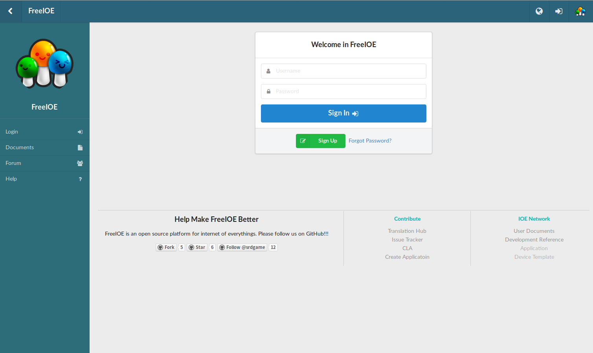
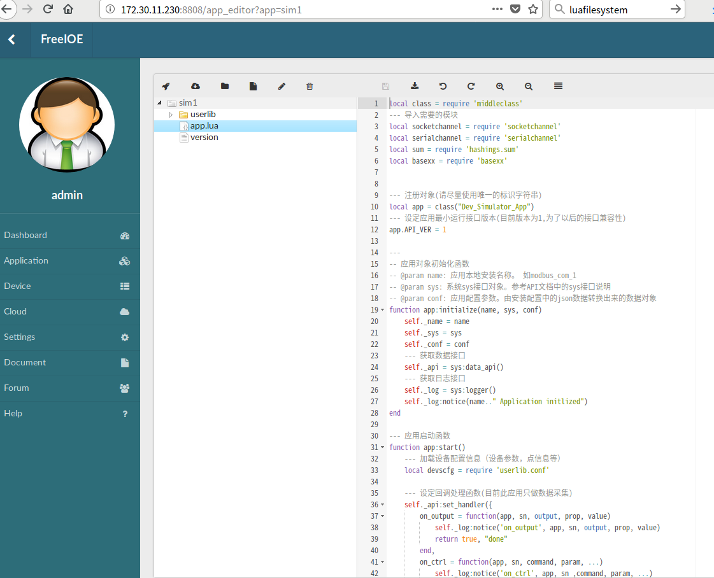

---

# 设备Web在线开发

## 1. 访问设备Web

FreeIOE设备内嵌有Web管理页面，访问Web管理页面有两种方式：

* 本地直接访问 http://&lt;设备ip&gt;:8808
	> 如无法访问，请留意设备的防火墙设定
* 通过云平台开启远程Web
	> 访问云平台上网关状态页面，开启Web映射的扩展功能
	> 访问 http://&lt;设备序列号&gt;.freeioe.in:880

## 2. 登录

FreeIOE内嵌Web管理系统需要用户登录。登录信息:
> 用户名: admin
>
> 密码: admin1
>
> ***用户登录后,请更改admin用户密码，已确保安全性***

## 3. 应用列表

应用列表页面提供以下功能:

1. 新建全新应用
2. 上传应用包并安装
3. 检查应用版本更新 (通过应用中心)
4. 查看FreeIOE 扩展包列表
5. 开启远程Web映射 ***请谨慎使用***
6. 开启SymLink 软件数据映射 ***只有设备中存在SymLink软件时才能正常工作***
7. 操作应用:
	* 启动/停止应用
	* 编辑应用配置
	* 更改应用实例名
	* 卸载应用
	* 编辑应用代码

## 4. 应用编辑

