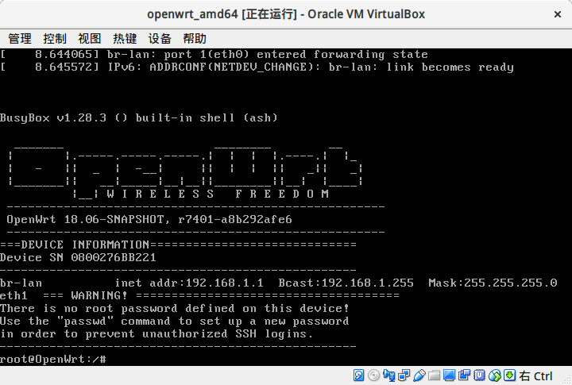

---

# 虚拟机开发环境

FreeIOE提供基于[虚拟机镜像](http://vbox.freeioe.org)，此镜像包含X86_64(glibc)的OpenWRT系统，以及初始安装的FreeIOE。可用以应用开发、测试等工作。

## 1. 下载虚拟机镜像

* 下载[地址](http://vbox.freeioe.org/freeioe.ova)
* 安装虚拟机软件（二选一）

  * [VirtualBox](http://virtualbox.org)
  * [VMWare Workstation](https://www.vmware.com)

* 导入下载好的虚拟机镜像(freeioe.ova)
* 开启虚拟机
* 等待虚拟机启动完毕

### 导入虚拟机

### 运行虚拟机

## 2. 添加虚拟设备

* 登录云平台
* 申请虚拟设备序列号

## 3. 连接云平台

更改虚拟设备序列号之后，设备才能正常连接云平台

* 访问地址: http:://<your\_device\_ip>:8808/cloud
> 虚拟机在其用户登录时有显示其获取的IP地址信息
* 在“云ID”的位置输入从平台申请的虚拟设备序列号，并点击“修改”
* 点击“重启”确保序列号生效

## 4. 开发应用

可以从下列方式中选择你喜欢的方式: 

* [使用VSCode插件开发](vscode-extension.md)
* [应用中心在线开发](app_center.md)
* [设备Web在线开发](dev_web.md)

