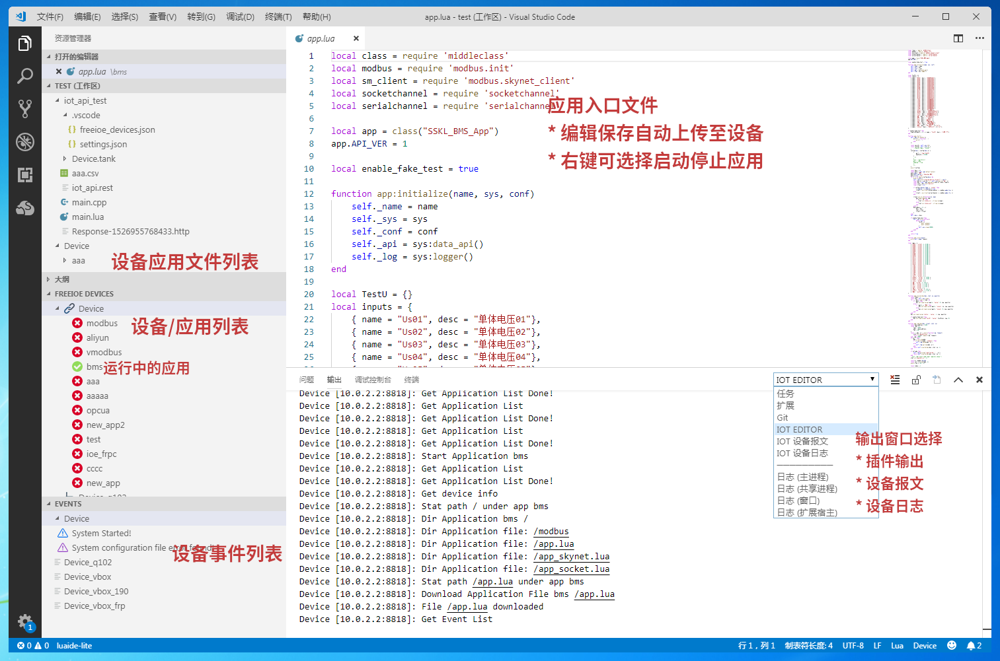

---

# 使用VS Code开发FreeIOE应用

## 下载VS Code

可以从微软网站下载VS Code。[地址](https://code.visualstudio.com/)

## 安装IOT Editor插件

运行VS Code后，安装IOT Editor插件。

> 另：建议安装Lua语言插件:
> * luaide-lite

## 使用 IOT Editor插件

### 开启IOT Editor使用步骤

* 打开工作目录
* 保存工作区
* Shift + Alt + P 搜索运行 "IOT: Setup editor workspace"
* 在打开的freeioe_devices.json文件中的devices节点下，输入正确的设备IP，并修改其设备名称
* Shift + Alt + P 搜索运行 "IOT: Connect to freeioe device"
* 选择你要连接的设备
* 当设备连接成功后，在工作区会出现以设备名为名称的目录节点（该节点映射了设备中的应用列表）

### IOT Editor 提供的功能

* 自动映射设备中的应用文件到工作区。 可以直接打开和保存文件，IOT Editor会自动同步到设备
* 输出窗口有设备日志，设备报文以及IOT Editor工作信息
* 设备列表窗口有配置文件中所有设备的节点，并可以手工进行连接/断开操作。可以同步连接多个设备。
* 事件列表可以显示已连接设备中的设备事件信息

## 使用 IOT Editor 新建应用

* Shift + Alt + P 搜索运行 "IOT: Create new application"
* 输入应用实例名称和应用名称
* 设备中会新建出带有模板代码的新应用。同时VS Code工作区会出现该应用目录。
* 打开应用下面的入口文件(app.lua)就可以开始您的应用开发之旅

## 下载应用包

当应用代码开发完毕，通过"Download Application"右键菜单下载应用包:

1. 文件浏览器窗口的应用目录点击右键
2. 设备列表窗口的应用节点点击右键

IOT Editor会从设备中下载打包好的应用包到指定的目录。请务必手工修改version文件，确保版本和应用中心上传时的版本一致。
