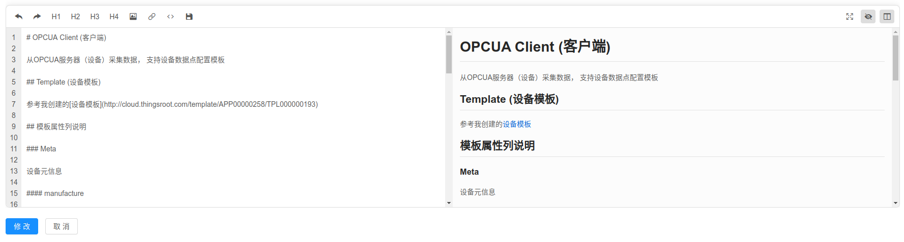
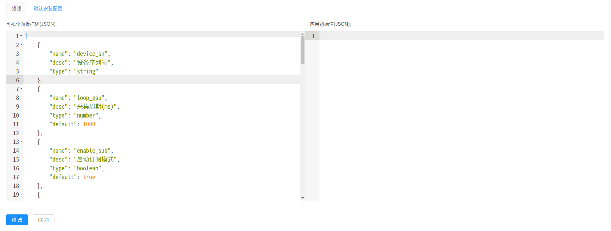

---

# 新建应用

获取开发者账户后，可以通过在 [我的应用](http://cloud.thingsroot.com/developer) 页面添加自己的应用

并填写以下信息：

1. 基本信息
2. 应用描述
3. 默认安装配置

## 应用基本信息

### 应用名称

展现给用户看的名称字符串

### 应用ID

平台后台唯一ID，不同用户可以有相同ID的应用。但是建议开发者使用比较有意义并且唯一的ID，而不是一些无意义的ID如，app1, test1, modbus这样的ID

## 应用描述

应用描述是Markdown文本，我们提供一个markdown编辑器，可以即时预览。

建议应用描述包含以下信息：

1. 应用功能描述
2. 应用配置项介绍
3. 应用模板项介绍(如有模板需求)
4. 其他补充信息

## 应用默认安装配置

为了方便用户填写、更改应用配置信息，冬笋云提供了应用配置可视化方案。 开发者可以通过上传可视化信息，让最终用户在安装应用时使用更加友好的可视化编辑配置，而不是枯燥的JSON文本编辑。

### 应用可视化配置模板

填写应用所需的配置模板信息，用以帮助云平台生成用户友好的可视化配置页面。

[应用可视化配置模板](https://github.com/thingsroot/cloud.thingsroot.com/wiki/App_Template)

### 应用配置初始值

填写应用配置初始值，来定义配置项的初始化配置。
