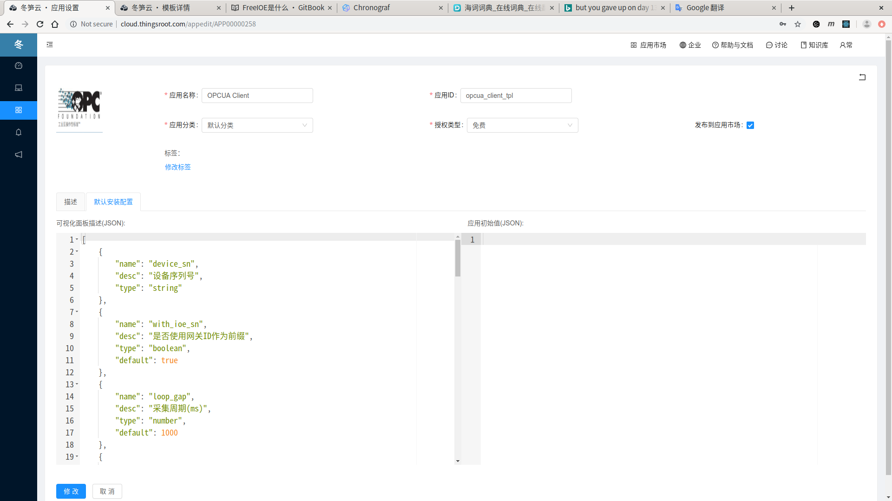

---

# 应用配置可视化

FreeIOE 在应用实例安装的时候可以使用不同的配置信息（JSON数据），如使用不同的串口，协议类型，产品型号等等。而这些信息会在应用对象实例化时，作为参数传给应用的构造函数。

``` lua
function app:initialize(name, sys, conf)
    --- conf 就是应用指定的配置信息
end
```

当应用配置项较多时，我们可以使用冬笋云平台提供的应用可视化配置，可以给提供给客户友好的、可视化的应用实例配置信息页面。

应用可视化配置信息，是冬笋云制定的一个可视化配置标准。设定页面如下:



该页面包含两个信息：

* 可视化配置描述 (JSON)
  描述可视化面板包含的配置项，以及配置项的可视化形式
* 应用初试值 (JSON)
  提供一个默认的配置信息

## 应用可视化配置的JSON格式说明

### 示例

下面是一个可视化的配置JSON示例：

``` json
[{
        "name": "protocol",
        "desc": "通讯协议",
        "type": "dropdown",
        "values": [
            "tcp",
            "rtu"
        ]
    },
    {
        "name": "Link_type",
        "desc": "链路类型",
        "type": "dropdown",
        "depends": {
            "socket": "socket",
            "serial": "serial"
        },
        "values": [
            "socket",
            "serial"
        ]
    },
    {
        "name": "socket",
        "desc": "TCP端口设定",
        "type": "tcp_client"
    },
    {
        "name": "serial",
        "desc": "串口设定",
        "type": "serial"
    },
    {
        "name": "tpls",
        "desc": "设备模板选择",
        "type": "templates"
    },
    {
        "name": "devs",
        "desc": "设备列表",
        "type": "table",
        "cols": [{
                "name": "addr",
                "desc": "Modbus地址",
                "type": "number"
            },
            {
                "name": "tpl",
                "desc": "设备模板",
                "type": "template"
            },
            {
                "name": "name",
                "desc": "设备名称",
                "type": "string"
            },
            {
                "name": "desc",
                "desc": "设备描述",
                "type": "string"
            },
            {
                "name": "sn",
                "desc": "设备序列号",
                "type": "string"
            }
        ]
    },
    {
        "name": "encryption",
        "desc": "证书选择",
        "type": "section",
        "child": [{
                "name": "cert",
                "desc": "UA证书(可选)",
                "type": "text",
                "value": "certs/cert.der"
            },
            {
                "name": "key",
                "desc": "KEY文件(可选)",
                "type": "string",
                "value": "certs/key.der"
            }
        ]
    }
]
```

## 说明

1. 可视化JSON模板信息的根节点必须是一个数组。
2. 由应用可视化生成的数据结果也是JSON,而其根节点是字典。
3. 可视化组件目前支持的类型(type)有：
    * boolean - 选择框
    * number - 数字输入项
    * string - 字符串输入框
    * text - 文本输入框(多行)
    * dropdown - 下拉框
    * tcp_client - TCP客户端选项设定 （包含服务器IP，服务器端口两部分）
    * serial - 串口配置选项 （包含波特率、数据位、停止位等等)
    * section - 数据组 (用来将一组基础类型进行分组)
    * fake_section - 数据组 (用来将一组基础类型进行分组， 但不会生成字节点)
    * table - 数据表格 （必须包含有cols字节点）
    * templates - 应用模板选择控件
    * template - 模板选择下拉框 (只能用在table组内)
4. 可视化节点的name是结果JSON中的KEY （fake_section除外)
5. 可视化节点的default属性为控件的默认值

### boolean/number/string/text

此四种为基础控件，可设定的属性有：

1. name: 在结果中的key名称
2. type: 类型
3. default: 默认值

### section

数据组（数据区域）的作用将控件进行区域分割，section下的child配置项的内容会出现在section的字节点下。

### fake_section

数据组（数据区域）的作用仅仅是将控件进行显示区域分割，并不会生成子节点。其child下的配置数据会出现在JSON根数据下。

### dropdown

下拉框UI控件,较之基础控件多出以下属性：

1. values: 字符串数组(对象数组)描述下拉框可选择项\
    当为对象数组时，对象需要包含name value两个字段，其中name字段用以显示，value字段用以生成JSON配置（depends存在的话也是基于value字段进行判断)
2. depends: 字典描述values下的可选择项所影响的UI控件名称(顶级控件或者本区域内的控件）

### tcp_client

TCP客户端连接属性配置，包括:

1. host: 服务器地址
2. port: 服务器端口
3. nodelay: 是否开启NODELAY模式

### serial

串口端口属性设定，包括：

1. port: 串口名称（如/dev/ttyS1)
2. baudrate: 波特率
3. data_bit: 数据位
4. stop_bits: 停止位
5. parity: 校验
6. flow_control: 流控

### templates

应用模板选择列表，包括：

1. key: 数组唯一ID
2. id: 应用模板在平台的ID
3. name: 本地名称
4. description: 本地描述
5. version: 应用模板的版本

### template

模板选择下拉框，目前只能出现在table空间内，可选择内容为templates节点的数据

### table

表格控件，自定义列的类型可以是：number/string/template/dropdown。 同时列的属性节点名称(name)应避免使用“key"，此名称保留给UI空间作为数组ID来使用

注: 表格中的dropdown控件不再支持depends功能。