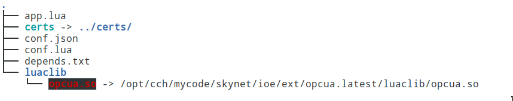

# 什么是 FreeIOE 应用

FreeIOE 应用是一个 **Lua 模块**，且实现了 FreeIOE 预定义的应用接口函数，从而能在 FreeIOE 调度下，完成所需的功能。

>
> 注意 FreeIOE 使用了一种面向对象的模块定义，所以请自行学习 Lua 的面向对象的模块开发说明。
> 您也可以选择 [middleclass](https://github.com/kikito/middleclass/wiki) 为基础来开发模块。
>

## 应用的结构

这里使用一个 OPCUA 协议应用来作为例子，讲述了一个用的目录结构都包含有那些文件。

### 目录结构

### 目录说明

* app.lua
应用模块入口文件
* certs
专属文件目录(OPCUA证书)
* conf.json
配置模板JSON文件
* conf.lua
应用模块所使用的子模块
* depends.txt
扩展依赖列表文件
* luaclib
应用使用的 C 扩展目录
* luaclib/opcua.so
由框架根据depends.txt内容自动映射过来的扩展模块
