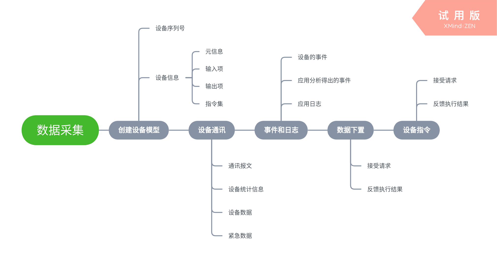

---

# 采集应用

此章将介绍如何开发一个设备数据采集应用。您将学习到什么是数据采集应用，构建此类应用都需要实现什么功能。

## 什么是设备数据采集

设备数据采集应用是通过某种通讯协议，获取其他智能设备中的传感器数据，并将数据发布到 FreeIOE 软件内的应用。简单来说，就是负责设备通讯，并将数据收集上来的应用。

这类应用在 FreeIOE 软件内，是设备数据的生产者。数据上云以及边缘计算类应用都是这些数据的消费者。





[示例代码](#示例代码)

## 创建设备模型

数据采集类应用为了向 FreeIOE 发布设备数据前，需要创建设备模型。设备模型是其他应用去理解该设备的一个描述性结构。而应用使用这个模型向 FreeIOE 注册一个设备实例，从而能够通过这个设备实例进行数据发布。

### 设备模型

设备模型的描述包含

* 元信息
* 输入项
* 输出项
* 指令集

#### 元信息(meta)

设备元信息包含以下内容:

1. name
   设备名称(云平台唯一名称, 如，某某锅炉，某某电表
2. description
   为设备产品的具体描述信息，如某某品牌三相交流智能电表
3. inst
   为选填属性，如 1#锅炉，3#电表， 办公室空调一号等。 是标记设备的友好名称
4. series
   为设备产品的系列号，如 S5500, S7-300
5. manufacturer
   设备厂家信息（如：冬笋科技（北京）有限公司)
6. link
   选填，设备详细信息的链接地址, 默认会是 ```http://device.freeioe.org/devices?name=<meta.name>```

您可在元信息中附加更多的静态信息。请勿使用meta来标记一些动态信息，FreeIOE 在设备实例创建、修改、删除时，会将网关内所有设备信息全量同步到平台。滥用元信息会导致流量浪费和平台的负载增加。

类似元信息，输入项、输出项以及指令集都可以自定义静态属性。

#### 输入项(inputs)

设备输入项是从实际传感器设备采集到的数据项，如A相电压、有功总功率等等。 也可以是计算出来的数据项，如当前4G数据发送总量、当日产量等等。只有输入项的数据、才可以进行数据发布。

```lua
local inputs = {}
table.insert(inputs, {
	name='Va',
	unit='V',
	desc='输出电压',
	vt='float',
})
```

##### name

输入项的名称，在本模型内不能重复，支持英文字母数字和下划线(_)。

##### desc

输入项的描述，建议使用简洁的描述信息。

##### unit

输入项的数据的单位，是可选属性。

##### vt

输入项发布数据的数值类型。类型有：

* float
  双精度浮点类型
* int
  具体限制参考 FreeIOE 编译时定义的整数类型，通常为64位整数
* string
  字符串类型

> 数据发布时，FreeIOE 会自动进行数据的验证以及转换，请务必填写正确的数据类型，确保数据的一致性和严禁性。
> FreeIOE 没有 boolean 类型，请使用 int 类型来模拟。通常我们建议 0 代表 false, 1 代表 true

#### 输出项(outputs)

当设备具备的对外输出的能力，如模拟量输出、开关量输出、可调节输出电压等等。在模型中声明这些输出项，用户就可从而平台可以进行设备数据下置。

```lua
local outputs = {}
table.insert(outputs, {
	name='V_output1',
	unit='V',
	desc='输出电压',
})
```

> 如同输入项，指令集的名称也有在设备模型内唯一性的要求。
> 通常用户通过平台下置的数据数值为字符串，应用需要进行数据验证和合理的类型转换。

#### 指令集(commands)

当设备支持的执行一些动作指令，如开启，停止，暂停，可以在设备模型中声明这些动作指令。 从而用户可以从平台发送设备指令请求。


```lua
local commands = {}
table.insert(commands, {
	name='start',
	desc='启动设备（无需参数)',
})
```

> 如同输入项，指令集的名称也有在设备模型内唯一性的要求。
> 平台在下发指令时附带一个param的数据结构，在lua里面是一个table的对象。 如同输出项下置一样，应用需要正确处理传入的参数的数据验证和合理的数据类型转换。

## 设备序列号

每一个具体的设备实例在平台内，都需要一个唯一的设备序列号。如果智能设备没有自己的唯一序列号，您可以使用基础模块的gen_sn函数来生成。

``` lua
local dev = self._api:add_device(sn, meta, inputs, outputs, commands)
```

## 发布设备数据

### 发布数据

当应用通过设备通讯协议，收到设备数据项的新的数值后，请使用下面接口进行设备数据发布:

```lua
dev:set_input_prop('Va', "value", val, now, 0)
```

其中：
val 为协议中解析出来的具体数据，其数据类型请和模型声明中的数据类型(vt)保持一致
now 是数据的时间戳，如协议中没有时间戳（如 modbus），请使用 FreeIOE 提供的系统时间

### 发布紧急数据

设备紧急数据是一种需要 FreeIOE 尽快将之传输至平台的设备数据。从而平台能够将此数据尽快的推送给用户，让用户尽快执行某种策略。

发布紧急数据的调用:

```lua
dev:set_input_prop_emergency('Va', "value", val, now, 0)
```

> 紧急数据将绕过一系列的上传检测/打包等操作，请谨慎使用。在冬笋平台下，此种数据会优先/即时传输至平台，保证数据的时效性。
> 请勿滥用此紧急数据接口，因为此接口会同步发布正常的数据，即一次数据会被传输两次（不同通道），滥用此接口会导致平台压力增加和流量使用的增加。

## 发布通讯报文

当应用支持用户在平台查看通讯报文，并根据报文诊断现场设备通讯时，可以使用此通讯报文发布接口。

```lua
dev:dump_comm('IN', msg)
```

其中第一个参数通常为方向性指示标志，如 IN OUT 等。 FreeIOE 并未限制这个参数，但是也请勿使用过长的描述性信息。

## 发布通讯统计

设备统计信息，如连接状态，通讯接收包数，通讯发送包数，通讯接收字节数，通讯发送字节数等等。

统计类型：

* status
* success_ratio
* error_ratio
* packets_in
* packets_out
* packets_error
* bytes_in
* bytes_out
* bytes_error

```lua
stat:inc('packets_in', 1)
```

## 输出应用日志

应用应该具备必要的日志信息，能够帮助客户理解应用的工作状态，以及获取错误、警告等信息。

参考[日志接口](../../../reference/app/logger.md)

```lua
self._log:trace("read input registers done!")
self._log:warning("Got err:", err, "more", "log content", here)
```

### 响应数据下置

当平台的设备输出请求到达网关后，此数据输出处理函数就会被调用。使用 app.base 作为应用基础类时，需要声明：

```lua
--- 处理设备输出项的数据下置请求
-- @param app_src 请求来源应用的实例名
-- @param sn 目标设备序列号
-- @param output 输出项名称
-- @param prop 输出项属性(默认为value)
-- @param value 输出数值
-- @param timestamp 数据源的时间戳，选项数据，可用于校验下置数据是否超过了时效。
function app:on_output(app_src, sn, output, prop, value, timestamp)
	-- 设备数据下置代码实现
end
```

本函数需要正确返回执行结果：执行成功返回true, 失败返回false, \<error\>。此函数可以进行sleep, yield操作。

### 响应指令

当平台的设备指令请求到达网关后，此指令处理函数就会被调用。使用 app.base 作为应用基础类事，需要声明：

```lua
--- 处理设备指令执行请求
-- @param app_src 请求来源应用的实例名
-- @param sn 目标设备序列号
-- @param command 指令名称
-- @param param 参数(可以是数值，字符串，table)
function app:on_command(app_src, sn, command, param)
	-- 设备指令执行代码实现
end,
```

本函数如同on_output一样，需要正确返回执行结果。 也可以进行sleep, yield等操作。

### 发布设备事件

当设备/应用出现异常，或者任何其他需要通知用户的事件信息，可以通过设备的事件接口发布。

```lua
local event = require 'app.event'
local info = "/tmp disk is nearly full!!!"
dev:fire_event(event.LEVEL_ERROR, event.EVENT_SYS, info, {used=10000000, free=0})
```

注意请勿频繁调用此接口，建议记录事件发布的时间，确保应用不会无限制的循环发布事件。虽然FreeIOE内置了事件发布的次数限制（20条/分钟)，但是强烈建议应用设定事件发布限制。

## 示例代码

```lua
local app_base = require 'app.base'

local app = app_base:subclass('THIS_IS_AN_SAMPLE_SUB_APP')
app.static.API_VER = 6 -- 可不设置

---
-- 应用对象初始化回调函数
-- @param name: 应用本地安装名称。 如modbus_com_1
-- @param sys: 系统sys接口对象。参考API文档中的sys接口说明
-- @param conf: 应用配置参数。由安装配置中的json数据转换出来的数据对象
function app:on_init()
	--- 设备实例
	self._devs = {}
	self._log:debug("XXXX Application initialized")
end

--- 应用启动函数
function app:on_start()
	--- 生成设备模型唯一序列号
	local sys_id = self._sys:id()
	local sn = self:gen_sn('example_device_serial_number')

	--- 创建设备模型
	local inputs = {
		{name="tag1", desc="tag1 desc", unit="KV", vt="float"}
	}
	local meta = self._api:default_meta()
	meta.name = "Example Device"
	meta.description = "Example Device Meta"
	--- 生成设备模型对象
	local dev = self._api:add_device(sn, meta, inputs)
	self._dev = dev
	--- 生成设备通讯口统计对象
	local stat = dev:stat('port')
	self._stat = stat

	return true
end

--- 应用退出函数
function app:on_close(reason)
    -- 处理通讯链路关闭等
end

--- 应用运行入口
function app:on_run(tms)
	local dev = self._dev
	local stat = self._stat
	dev:dump_comm("IN", "XXXXXXXXXXXX")
	dev:set_input_prop('tag1', "value", math.random())
	stat:inc('packets_in', 1)

	return 10000 --单位是ms, 10000代表下一采集间隔为10秒。 等同于sleep(10000)
end

--- 返回应用对象(标准模块做法)
return app
```
