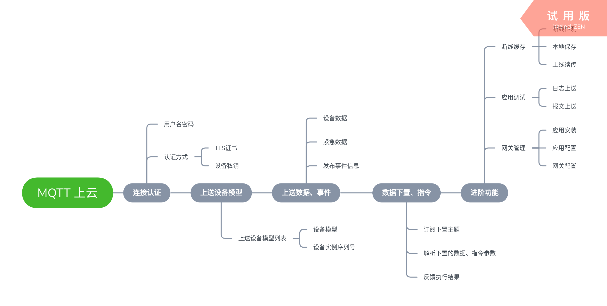

---

# 数据上云

此章将介绍如何开发一个数据上云的应用。您将学习到如何使用 MQTT 协议将 FreeIOE 内的设备数据送到云平台。

## 什么是 MQTT 协议

MQTT 是物联网云平台常见的一种对接协议，更多内容可以访问 [MQTT 协议简介](https://wiki.freeioe.org/doku.php?id=mqtt:start)



## 连接认证

为了简化例程，我们使用了匿名的、非安全的连接方式。需要设定连接参数：
* 服务器地址
* 服务器端口(1883)

``` lua
function app:on_init()
	local conf = self.conf
	conf.server = "192.168.1.100" --- MQTT 服务器地址
	conf.port = 1883 -- MQTT端口
end
```

> 更多参数请参考[接口手册](../../../reference/app/base/mqtt.md)

## 上送设备模型

上送数据模型时，我们需要实现下面的函数:

``` lua
function app:on_publish_devices(devices)
	--- converto devices to json string
	local data, err = cjson.encode(devices)
	if not data then
		return nil, err
	end
	return self:publish(self._mqtt_id.."/devices", data, 1, true)
end
```

devices 参数是一个 Lua 的 Table 数据，是以设备序列号为 KEY， 设备模型为 VALUE 的 Table 数据。

## 上送设备数据、事件

### 设备数据

通过实现下属函数，就能接收其他应用发布的设备数据，并通过 publish 方式发布数据到云平台。

```lua
--- 单个数据上送
function app:on_publish_data(key, value, timestamp, quality)
	local msg = {{key, value, timestamp, quality}}
	return self:publish(self._mqtt_id.."/data", cjson.encode(msg), 0, false)
end

--- 打包上送
function app:on_publish_data_list(val_list)
    local data = cjson.encode(val_list)
	return self:publish(self._mqtt_id.."/data", data, 0, false)
end
```

参数说明:
1. key
   数据关键字信息，默认为 <device_sn>/<input_name>/<input_prop_name>，如需要更改，请实现```app:pack_key(app_src, device_sn, input, prop)``` 函数
2. value
   数据值，类型请参考对应的模型信息中的 vt 字段
3. timestamp
   时间戳，如： 1575370087.13
4. quality
   质量戳，如： 0

> 关于数据的打包上送的参数调整，请参考[接口手册](../../../reference/app/base/mqtt.md)

### 设备紧急数据

这里我们使用了跟普通数据同一个主题来发布紧急数据。


```lua
function app:on_publish_data(key, value, timestamp, quality)
	local msg = {{key, value, timestamp, quality}}
	return self:publish(self._mqtt_id.."/data", cjson.encode(msg), 0, false)
end
```

### 上送事件

应用、设备会产生事件时，我们可以通过实现 ```on_event``` 函数来将我们需要的事件信息，上送到云平台。

```lua

function app:on_event(app, sn, level, type_, info, data, timestamp)
	local event = {
		level = level,
		['type'] = tyep_,
		info = info,
		data = data,
		app = app
	}
	local msg = {sn, event, timestamp}
	return self:publish(self._mqtt_id.."/event", cjson.encode(msg), 1, false)
end
```

## 数据下置、设备指令

云平台若是需要下置数据到设备、请求设备执行某条指令，则需要根据平台的标准，去订阅接收数据和指令的主题。然后通过 ```device:set_output_prop``` 和 ```device:send_command```来发起请求。

```lua

--- 下置数据

	local device, err = self._api:get_device(data.device)
	if not device then
		return self:on_mqtt_result(id, false, err or 'Device missing!')
	end

	local priv = {id = id, data = data}
	local r, err = device:set_output_prop(data.output, data.prop or 'value', data.value, ioe.time(), priv)


--- 发起设备指令请求
	local device, err = self._api:get_device(data.device)
	if not device then
		return self:on_mqtt_result(id, false, err or 'Device missing!')
	end

	local priv = {id = id, data = data}
	local r, err = device:send_command(data.cmd, data.param or {}, priv)
```

在 FreeIOE 的其他应用执行数据下置、设备指令并反馈结果后，下列函数将被调用

```lua
--- 数据下置结果反馈
function app:on_output_result(app_src, priv, result, err)
	if not result then
		self._log:error('Set output prop failed!', err)
		return self:on_mqtt_result(priv.id, false, err or 'Set output prop failed')
	else
		return self:on_mqtt_result(priv.id, true, 'Set output prop done!!')
	end
end

--- 设备指令执行结果反馈
function app:on_command_result(app_src, priv, result, err)
	if not result then
		self._log:error('Device command execute failed!', err)
		return self:on_mqtt_result(priv.id, false, err or 'Device command execute failed!')
	else
		return self:on_mqtt_result(priv.id, true, 'Device command execute done!!')
	end
end
```

## 进阶阅读

* Payload 压缩

* 断线缓存

* 应用调试

* 网关管理

## 示例代码
