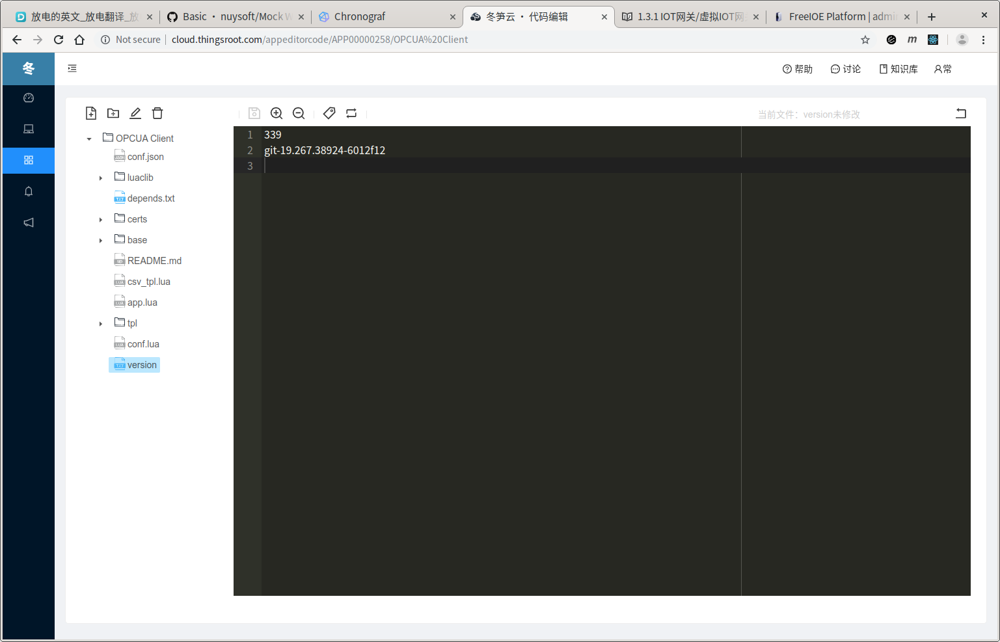

---

# 云平台在线开发

[云平台](http://cloud.thingsroot.com) 提供在线编辑应用代码，以及发布版本更新等功能。

## 申请开发者权限

开发者权限需要提交[申请](http://cloud.thingsroot.com/developer/reg)

> 赞不支持开发者权限申请，请联系平台管理员，开通开发者权限。

## 创建新应用

登录[云平台](http://cloud.thingsroot.com)后，进入我的应用页面，即可创建新的应用。

## 编辑应用

在已经创建的应用详情页面点击**在线编辑**按钮，即可开启云平台在线编辑。

