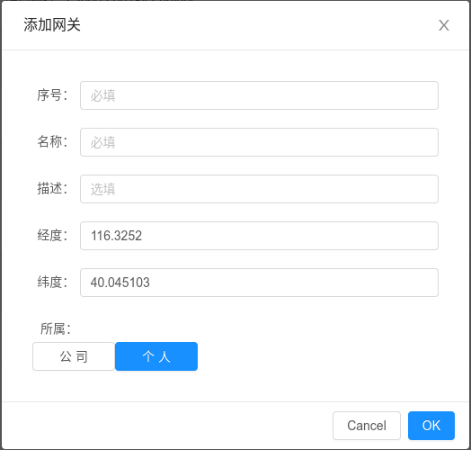

---

# FreeIOE 网关

FreeIOE 应用只能在网关产品上才能运行和调试，所以在开发应用之前，请先获取集成有 FreeIOE 的网关产品。[网关硬件产品列表](https://wiki.freeioe.org/doku.php?id=hardwares:start)

> 若您没有条件获取硬件产品，也可以通过使用 [虚拟网关](vbox.md) 来进行应用的开发和调试

FreeIOE 网关会开机自动连接冬笋云平台，建议您在使用产品前，先登录平台并将网关添加到您的名下。从而可以通过冬笋平台完成网关配置管理操作。

## 添加网关

在开始前，请阅读网关产品说明书，找到网关产品的序列号。

>
> 外部无法找到产品序列号，或者序列号被刮花?
>
> 您可以使用浏览器（推荐chrome或者firefox）访问网关的8808端口。
> 使用admin/admin1登录
> 在仪表盘页面顶部有网关的序列号

在云平台网关列表页面选择添加网关：

> 注意:
> 如遇到网关添加不成功，请联系平台管理员。