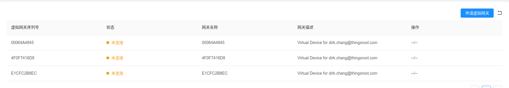

---

# 虚拟机开发环境

您可以使用基于虚拟机的虚拟网关，来进行应用开发、调试等工作。此虚拟机操作系统是 OpenWRT，并初始安装有 FreeIOE 。

## 下载虚拟机镜像

虚拟机镜像[下载地址](https://thingscloud.oss-cn-beijing.aliyuncs.com/download/freeioe.zip)，请下载完毕后进行文件解压后使用。

建议使用 VirtualBox 或者 VMWare Workstation 虚拟机软件来使用此虚拟机
  * [VirtualBox](http://virtualbox.org)
  * [VMWare Workstation](https://www.vmware.com)

下面我们使用VirtualBox来作为示例，介绍如何导入并使用虚拟网关。

### 导入虚拟机

从管理菜单中，选择”导入虚拟电脑“


选择刚才下载并解压后的镜像文件。


选中 **重新初始化所有网卡的 MAC 地址(R)**，点击"导入”后，等待软件完成导入操作。

### 运行虚拟机

虚拟机运行成功后，在界面激活用户命令行时，能看到设备的网络信息。

* br-lan
  虚拟机设置中的网卡1，内部网络（请忽略）
* eth1
  虚拟机设置中的网卡2，虚拟用以上网的网络，以及使用WEB进行虚拟网关配置要用的网卡


注：
使用浏览器访问eth1的IP的8808端口，看到FreeIOE的管理页面，即说明虚拟机运行正常。

> 备注： 在某些虚拟机软件版本下，虚拟机的网卡列表是相反的，当出现下图eth1无法获取IP，或者获取的IP为192.168.56.X时，请尝试将虚拟机网卡1和网卡2的设置交换一下。

## 平台添加虚拟网关

虚拟网关如需在平台上进行管理，需要在平台进行申请虚拟网关序列号。

### 申请虚拟网关

* 登录[云平台](http://cloud.thingsroot.com)
* 进入[虚拟网关](http://cloud.thingsroot.com/virtualgateways)页面
* 按照说明申请虚拟网关后，复制出现的虚拟网关序列号



### 修改虚拟网关的连接用序列号

需要更改虚拟设备的序列号，虚拟设备才能正常连接云平台，修改步骤如下：

* 使用浏览器访问虚拟机的8808端口: ```http:://<eth1_ip>:8808/cloud```
* 在“云 ID(Cloud ID)” 的位置输入从平台申请的虚拟设备序列号，并点击“修改(Change)”
* 点击页面下方的“重启(Reboot)”确保序列号生效


完成序列号更改，此时云平台的网关列表页面应能看到虚拟网关的状态为在线状态。
