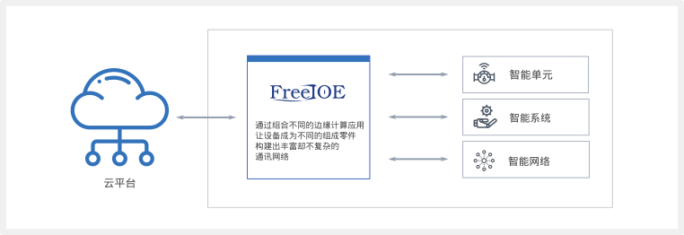
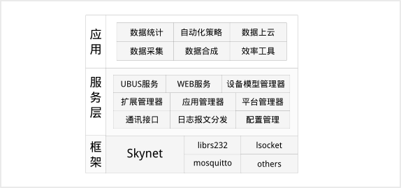

---

# 什么是 FreeIOE

***[FreeIOE](http://freeioe.org)*** 是一个[物联网](iot.md)边缘计算软件。该软件使设备能够收集和分析设备数据，自主应对本地事件，并可与本地网络上的其他服务进行交互。FreeIOE开发人员可以使用Lua语言和内置的一些功能模块来创建可部署到FreeIOE设备上的本地执行的应用程序。

FreeIOE 使客户能够构建IOT网关设备和边缘计算应用程序。具体来说，FreeIOE 对设备上运行的应用程序提供了在线的平台式远程管理。本地部署的应用程序可以进行设备通讯，数据计算处理，数据上送以及平台的互动等。

本地部署的 FreeIOE 应用程序可以在本地进行数据交换，而不必连接到云。FreeIOE 提供了方便完善本地数据发布/订阅接口，也提供了程序间一对一的通讯接口。并且在本地智能缓存数据，使云的连接在短时间断开时得以保留。

FreeIOE 也是一个开源的软件，客户可在不同的嵌入式硬件上快速构建边缘计算节点，以适配不同的场景或成本需求。

FreeIOE 包含一下功能：

* 软件分发
  * 应用程序
  * FreeIOE 核心
  * FreeIOE 二进制扩展包
* 核心功能
  * 应用程序健康监控
  * 设备数据缓存和分发
  * 通讯报文缓存和分发
  * 日志缓存和分发
  * 事件分发
  * 统计数据缓存和分发
  * 冬笋云平台的集成管理

FreeIOE 提供的边缘计算接口

* 应用接口
  * 设备数据接口
  * 设备事件接口
  * 统计数据接口
  * 应用交互接口
  * 本地资源访问
  * 配置在线存取接口
* 辅助模块
  * 数据缓存模块
  * 累计量统计模块
  * 流数据处理模块
  * MQTT基础模块
  * 文件处理模块(csv,json)
  * HTTP请求模块
  * 哈希算法模块

图示：

## 技术社区

* ***[FreeIOE 社区](http://freeioe.org)***
* ***[冬笋云社区](http://forum.thingsroot.com)***

## 集成产品

### [冬笋科技](http://www.thingsroot.com)

冬笋科技提供的一体化物联网智能网关 [ThingsLink](https://thingsroot.com/product) 以及FreeIOE的管理维护平台 [冬笋云](https://cloud.thingsroot.com)

### [北京旋思科技](http://www.symid.com)

旋思科技提供的以FreeIOE为边缘计算核心的 [SymLink物联网智能网关](http://symid.com/Hardwares_feature.aspx?nid=206)

## 了解更多

请[联系](mailto:market@freeioe.org)
